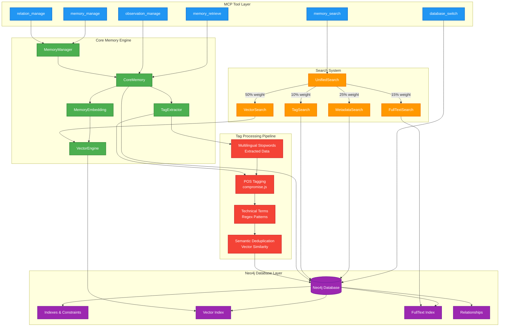
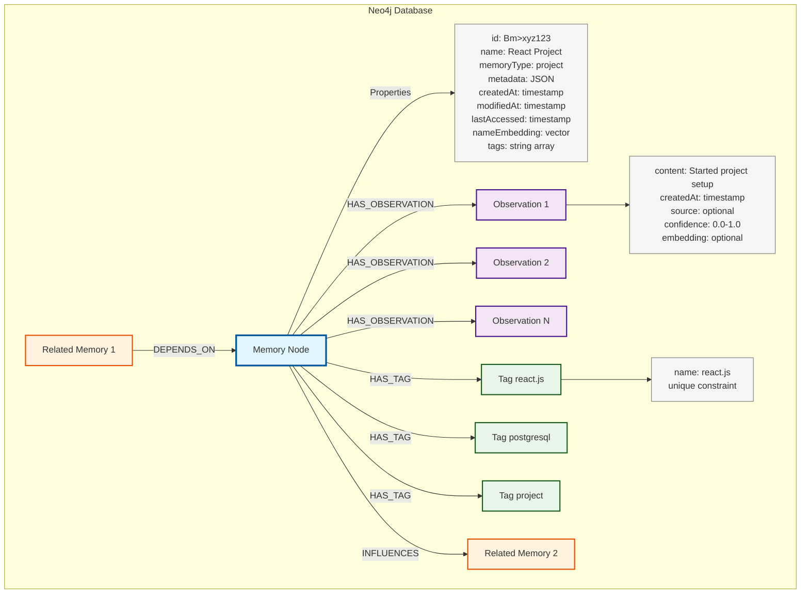

# MCP Neo4j Knowledge Graph Memory Server v2.0.9

*A Model Context Protocol (MCP) server that provides persistent memory capabilities using Neo4j as the backend. Features structured memory guidance, semantic search, knowledge graphs, and anti-fragmentation architecture.*

## Features

- **Structured Memory Architecture**: Metadata for schemas/patterns, observations for complete procedures
- **Anti-fragmentation Guidance**: Prevents scattered information through architectural discipline  
- **Persistent Memory**: Store and retrieve information across AI conversations
- **Semantic Search**: Natural language queries using vector embeddings  
- **Knowledge Graphs**: Build relationships between memories
- **Structured Metadata**: JSON storage with full-text search
- **Enhanced Tag Extraction**: Multilingual keyword extraction with semantic deduplication
- **Neo4j Compatibility**: Works with Community, Enterprise, and AuraDB


## Memory system architecture



## API Overview (v2.0.9)

**Core Operations (6 tools total):**
- `memory_manage`: Create, update, delete memories with structural guidance *(consolidated from 3 tools)*
- `memory_retrieve`: Fetch memories by ID with graph context and architectural patterns
- `memory_search`: Enhanced unified search with anti-fragmentation hints
- `observation_manage`: Add, delete complete functional modules *(consolidated from 2 tools)*
- `relation_manage`: Create, delete memory relations with schema alignment *(consolidated from 2 tools)*
- `database_switch`: Database management with architectural organization

*Features structural memory guidance preventing information fragmentation through metadata/observations separation and complete functional modules*

## Quick Start

```bash
npm install @sylweriusz/mcp-neo4j-memory-v2
```

Add to `claude_desktop_config.json`:

```json
{
  "mcpServers": {
    "memory": {
      "command": "npx",
      "args": ["-y", "@sylweriusz/mcp-neo4j-memory-v2"],
      "env": {
        "NEO4J_URI": "bolt://localhost:7687",
        "NEO4J_USERNAME": "neo4j", 
        "NEO4J_PASSWORD": "your-password"
      }
    }
  }
}
```
## Neo4j instalation

[How to install NEO4j](README.NEO4J.md)

## Usage

### Basic Operation

Once configured, the memory server integrates automatically with your AI assistant. No additional setup required—just start using it naturally in conversation.

```bash
# Example: AI automatically remembers and recalls
You: "Remember that I prefer TypeScript over JavaScript"
AI: "I'll remember your TypeScript preference for future discussions."

You: "What do we know about the Q4 budget?"  
AI: "Let me search... I found three related memories about Q4 budget planning..."
```

### Consolidated Tool Usage

**Memory Management:**
```javascript
// Create memories
{
  "operation": "create",
  "memories": [
    {
      "name": "Project Alpha",
      "memoryType": "project",
      "metadata": { "status": "active" },
      "observations": ["Project initiated"]
    }
  ]
}

// Update memory metadata  
{
  "operation": "update",
  "updates": [
    {
      "id": "Bm>xyz123",
      "metadata": { "status": "completed" }
    }
  ]
}

// Delete memories
{
  "operation": "delete", 
  "identifiers": ["Bm>xyz123", "Bm>abc456"]
}
```

**Observation Management:**
```javascript
// Add observations
{
  "operation": "add",
  "observations": [
    {
      "memoryId": "Bm>xyz123",
      "contents": ["Progress update", "Milestone achieved"]
    }
  ]
}

// Delete observations
{
  "operation": "delete",
  "observations": [
    {
      "memoryId": "Bm>xyz123", 
      "contents": ["Outdated information"]
    }
  ]
}
```

**Relation Management:**
```javascript
// Create relations
{
  "operation": "create",
  "relations": [
    {
      "fromId": "Bm>abc789",
      "toId": "Bm>xyz123",
      "relationType": "includes"
    }
  ]
}

// Delete relations
{
  "operation": "delete",
  "relations": [
    {
      "fromId": "Bm>abc789",
      "toId": "Bm>xyz123", 
      "relationType": "includes"
    }
  ]
}
```

### Memory Structure

```json
{
  "id": "Bm>xyz123",
  "name": "Project Alpha",
  "memoryType": "project", 
  "metadata": {
    "status": "active",
    "deadline": "2025-06-01"
  },
  "observations": [
    {
      "content": "Requirements gathering completed",
      "createdAt": "2025-05-19T16:45:42.329Z"
    },
    {
      "content": "Team assigned and kickoff scheduled",
      "createdAt": "2025-05-19T16:45:43.102Z"
    }
  ],
  "related": {
    "ancestors": [
      {"id": "Bm>abc789", "name": "Initiative Beta", "relation": "DEPENDS_ON", "distance": 1}
    ],
    "descendants": [
      {"id": "Bm>def456", "name": "Task Gamma", "relation": "INFLUENCES", "distance": 1}
    ]
  }
}
```

### Enhanced Unified Search Strategy

The search engine uses a sophisticated multi-channel approach:

- **Vector Similarity (50% weight)**: Semantic understanding via embeddings
- **Metadata Exact Matching (25% weight)**: High-precision structured data matching
- **Metadata FullText (15% weight)**: Flexible text search across JSON metadata
- **Tag Matching (10% weight)**: Keyword-based discovery

All queries include 2-level graph context with accurate relationship types and chronological observation ordering.



### For Memory-Driven Projects

If you're building a memory-driven system, consider this system prompt preamble:

```text
You are an AI assistant with persistent memory capabilities through an MCP memory server.

MEMORY PROTOCOL:
- Begin sessions by searching existing memories with memory_search
- Store user information in structured categories: identity, preferences, goals, relationships, context
- Use metadata for searchable fields (dates, statuses, types)
- Use observations for detailed narrative content
- Create relations between connected memories
- Update information when it changes rather than duplicating

MEMORY TYPES:
- user: Personal information and preferences
- project: Work items and initiatives  
- conversation: Important discussion points
- relationship: People and connections
- knowledge: Facts and learned information

TOOL USAGE:
- Use memory_manage for all create/update/delete operations with operation discriminators
- Use observation_manage and relation_manage for content modifications
- Always search before creating to avoid duplicates

Always search before creating to avoid duplicates. Organize information logically using the graph structure.
```

This preamble establishes consistent memory behavior for AI systems designed around persistent context.

## License

MIT License - see [LICENSE](LICENSE) file for details.
