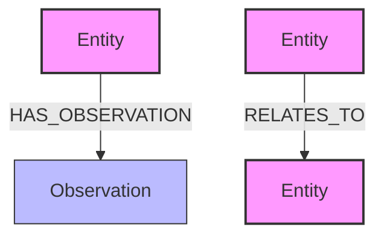

# MCP Neo4j Knowledge Graph Memory Server

A Model Context Protocol (MCP) server that uses Neo4j as a backend for knowledge graph storage and retrieval.

## Installation

### Installing via NPM

```bash
npm install @sylweriusz/mcp-neo4j-memory-server
```

### Manual install

Add `@sylweriusz/mcp-neo4j-memory-server` in your `claude_desktop_config.json`:

```json
{
  "mcpServers": {
    "graph-memory": {
      "command": "npx",
      "args": [
        "-y",
        "@sylweriusz/mcp-neo4j-memory-server"
      ],
      "env": {
        "NEO4J_URI": "bolt://localhost:7687",
        "NEO4J_USERNAME": "neo4j",
        "NEO4J_PASSWORD": "your-password",
        "NEO4J_DATABASE": "neo4j"
      }
    }
  }
}
```

### Docker

Build:

```bash
docker build -t mcp-neo4j-graph-memory .
```

Run:

```bash
docker run -dit \
  -e NEO4J_URI=bolt://neo4j:7687 \
  -e NEO4J_USERNAME=neo4j \
  -e NEO4J_PASSWORD=password \
  -e NEO4J_DATABASE=neo4j \
  mcp-neo4j-graph-memory
```

## Configuration

Configure Neo4j connection using environment variables:

| Variable | Description | Default |
|----------|-------------|---------|
| `NEO4J_URI` | URI for Neo4j connection | `bolt://localhost:7687` |
| `NEO4J_USERNAME` | Neo4j username | `neo4j` |
| `NEO4J_PASSWORD` | Neo4j password | `password` |
| `NEO4J_DATABASE` | Neo4j database name | `neo4j` |

You can set these in your environment, .env file, or in the configuration as shown above.

## Usage

Use the example instruction below with Claude or other AI assistants that support the MCP protocol:

```
Follow these steps for each interaction:

1. User Identification:
   - You should assume that you are interacting with default_user
   - If you have not identified default_user, proactively try to do so.

2. Memory Retrieval:
   - Always begin your chat by saying only "Remembering..." and search relevant information from your knowledge graph
   - Create a search query from user words, and search things from "memory". If nothing matches, try to break down words in the query at first ("A B" to "A" and "B" for example).
   - Always refer to your knowledge graph as your "memory"

3. Memory
   - While conversing with the user, be attentive to any new information that falls into these categories:
     a) Basic Identity (age, gender, location, job title, education level, etc.)
     b) Behaviors (interests, habits, etc.)
     c) Preferences (communication style, preferred language, etc.)
     d) Goals (goals, targets, aspirations, etc.)
     e) Relationships (personal and professional relationships up to 3 degrees of separation)

4. Memory Update:
   - If any new information was gathered during the interaction, update your memory as follows:
     a) Create entities for recurring organizations, people, and significant events
     b) Connect them to the current entities using relations
     c) Store facts about them as observations
```

## Implementation Details

This implementation uses Neo4j as the backend storage system, focusing on three key aspects:

### Graph Database Structure

The knowledge graph is stored in Neo4j with the following schema:



Properties:
- Entity nodes: `name`, `entityType`
- Observation nodes: `content`
- RELATES_TO relationships: `relationType`

This schema design allows for efficient storage and retrieval of knowledge graph components while leveraging Neo4j's native graph capabilities.

### Fuzzy Search Implementation

The implementation combines Neo4j Cypher queries with Fuse.js for flexible entity searching:

- Neo4j Cypher queries retrieve the base data from the database
- Fuse.js provides fuzzy matching capabilities on top of the retrieved data
- This hybrid approach allows for both structured graph queries and flexible text matching
- Search results include both exact and partial matches, ranked by relevance

### Advantages 

1. **Native Graph Structure**: Neo4j's graph database provides a natural fit for knowledge graph data, with nodes, relationships, and properties.
2. **Optimized Traversal**: Neo4j excels at navigating complex relationships between entities.
3. **Scalability**: Better performance with large knowledge graphs due to Neo4j's optimized graph storage and retrieval.
4. **Query Expressiveness**: Cypher query language makes complex graph patterns easier to express and query.
5. **Visualization**: Native support for graph visualization in Neo4j Browser.

## Development

### Setup

```bash
pnpm install
```

### Testing

```bash
pnpm test
```

## License

This project is licensed under the MIT License - see the [LICENSE](LICENSE) file for details.
